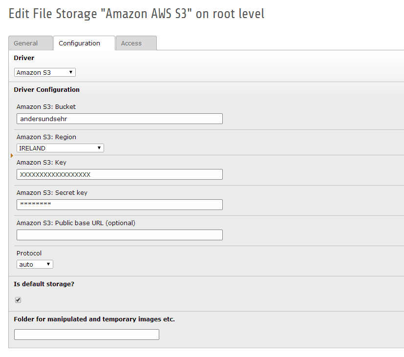
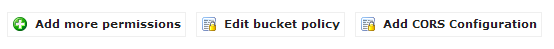

.. ==================================================
.. FOR YOUR INFORMATION
.. --------------------------------------------------
.. -*- coding: utf-8 -*- with BOM.

.. include:: ../../Includes.txt

Driver Configuration
--------------------

Add the following configurations:

- Bucket: The name of your AWS S3 bucket

- Region: The region of your bucket (avoid dots in the bucket name)

- Key and secret key of your AWS account (see security credentials -> access keys)

- Public base url (optional): this is the public url of your bucket, if empty its default to "bucketname.s3.amazonaws.com"

- Protocol: network protocol (https://, http:// or auto detection)

Example configuration:
^^^^^^^^^^^^^^^^^^^^^^

	AWS S3 config

Hint: Amazon AWS S3 bucket configuration
^^^^^^^^^^^^^^^^^^^^^^^^^^^^^^^^^^^^^^^^

Make sure that your AWS S3 bucket is accessible to public web users.

For example add the following default permissions to "Edit bucket policy":

	S3 bucket config

Example permissions:

.. code-block:: none

	{
		"Version": "2008-10-17",
		"Statement": [
			{
				"Sid": "AddPerm",
				"Effect": "Allow",
				"Principal": "*",
				"Action": "s3:GetObject",
				"Resource": "arn:aws:s3:::bucketname/*"
			}
		]
	}

