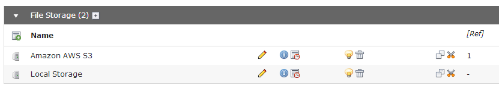

.. ==================================================
.. FOR YOUR INFORMATION
.. --------------------------------------------------
.. -*- coding: utf-8 -*- with BOM.

.. include:: ../../Includes.txt

Installation
------------

Add a new file storage with the "Amazon S3" driver to root page (pid = 0).

