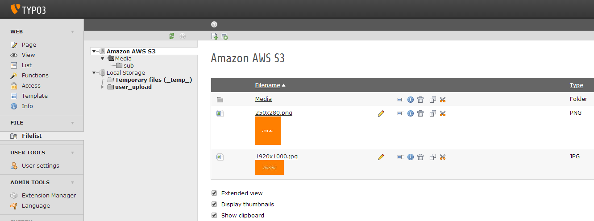

.. ==================================================
.. FOR YOUR INFORMATION
.. --------------------------------------------------
.. -*- coding: utf-8 -*- with BOM.

.. include:: ../Includes.txt

What does it do?
================

This is a driver for the file abstraction layer (FAL) to support Amazon AWS S3.

You can create a file storage which allows you to upload/download and link the files to an AWS S3 bucket. It also supports the TYPO3 CMS image rendering.

Requires TYPO3 CMS 10.4 or higher

Issue tracking: `GitHub Issues: AWS S3 FAL Driver <https://github.com/andersundsehr/aus_driver_amazon_s3/issues>`_

	Two storages are installed here

